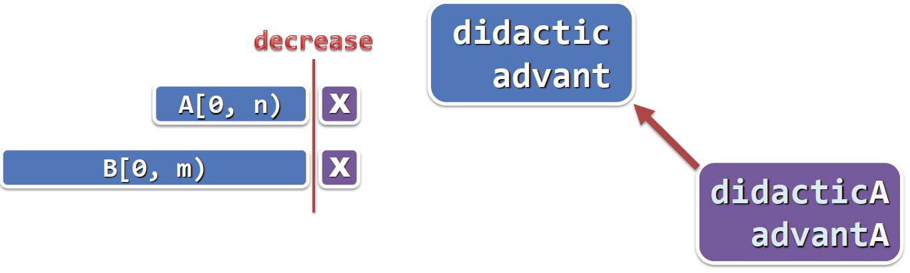
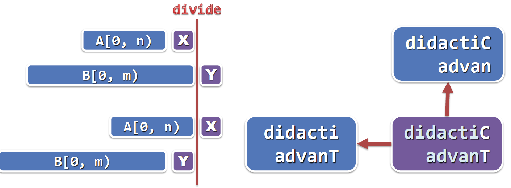

# Longest Common Subsequence
	问题：
	1)子序列：对于任一序列A=a1a2a3...an,删除其中若干项，剩余的序列叫作A的子序列
		对于一个长度为n的子序列，共有2^n个子序列
	2)公共子序列：如果一个序列C即是序列A的子序列，又是序列B的子序列，则称C为序列A和序列B的公共子序列
	3)序列A与序列B的公共子序列中，长度最长的公共子序列叫作序列A和序列B的最长公共子序列

	现给定长度为n的序列A与长度为m的序列B，求它们的最长公共子序列
#### 方法1.以递归的方式求解
	对于序列A[0,n]和序列B[0,m],以及函数LCS(A,n,B,m)
###### 0）A = ‘’或B = ‘’时
    取做空序列('')           //递归基
###### 1）A[n] == B[m]时
    去掉A和B最后一个字符，比较A[0,n)，B[0,m)取做LCS(A,n-1,B,m-1)+A[n]   // 减而治之

###### 2）A[n] != B[m]时
此时有两种情况:        // 分而治之
* 第一种是A的末字符对整个公共子序列没有贡献，去掉A的末字符，递归比较A[0,n),B[0,m],取做LCS(A,n-1,B,m)
* 第二种是B的末字符归对整个公共子序列没有贡献，去掉B的末字符，递归比较A[0,n],B[0,m),取做LCS(A,n,B,m-1)

最后结果就是在上述两种情况中，取结果最长的一种情况，取做max(LCS(A,n-1,B,m), LCS(A,n,B,m-1))     

###### 代码如下：
```
int LCS(char* A, int n, char* B, int m)
{
	if (n <= 0 || m <= 0)	//当A或B为空序列时，递归基
		return 0;
	else if (A[n - 1] == B[m - 1])	// 当A与B末字符相同时，减而治之
		return LCS(A, n - 1, B, m - 1) + 1;
	else							// 当A与B末字符不相同时，分而治之
		return max(LCS(A, n - 1, B, m), LCS(A, n, B, m - 1));
}
```
###### 效率：
    在最好的情况下（不出现第二种情况），每一次递归，A序列与B序列都减少一个字符，所以最大需要O(n+m)时间
    如果出现第二种情况，将原问题分解成两个子问题，随后的再发生的子问题会出现雷同的情况
    如图所示，任一一个子问题的雷同数目是，初始问题到子问题的所有合法通路的总数，需要用到组合数学里面的选排C
    所以在最坏的情况下，时间复杂度为Ω(2^n)


##### 故，为了解决大量重复的递归实例问题，使用动态规划的策略
#### 方法2.以动态规划的方式求解，迭代
    对于序列A[0,n]和序列B[0,m],A和B的前缀组合总共不会超过O(n*m)种
    使用动态规划只需O(n*m)时间计算出所有子问题
###### 0）将所有子问题列成一张表
###### 1）与方法1颠倒计算方向，从A[0],B[0]依次计算出所有项
###### 代码如下：

```
int LCS_iteration(char* A, int n, char* B, int m)
{
	int** record = new int*[n + 1];
	for (int i = 0; i < n + 1; ++i)		// 初始化二维表
		record[i] = new int[m + 1]();

	for (int i = 1; i < n + 1; ++i)
	{
		for (int j = 1; j < m + 1; ++j)
		{
			if (A[i - 1] == B[j - 1])
				record[i][j] = record[i - 1][j - 1] + 1;
			else
				record[i][j] = max(record[i - 1][j], record[i][j - 1]);
		}
	}
	return record[n][m];
}
```


