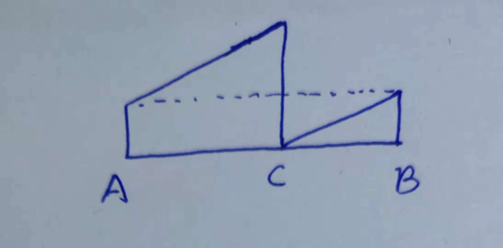
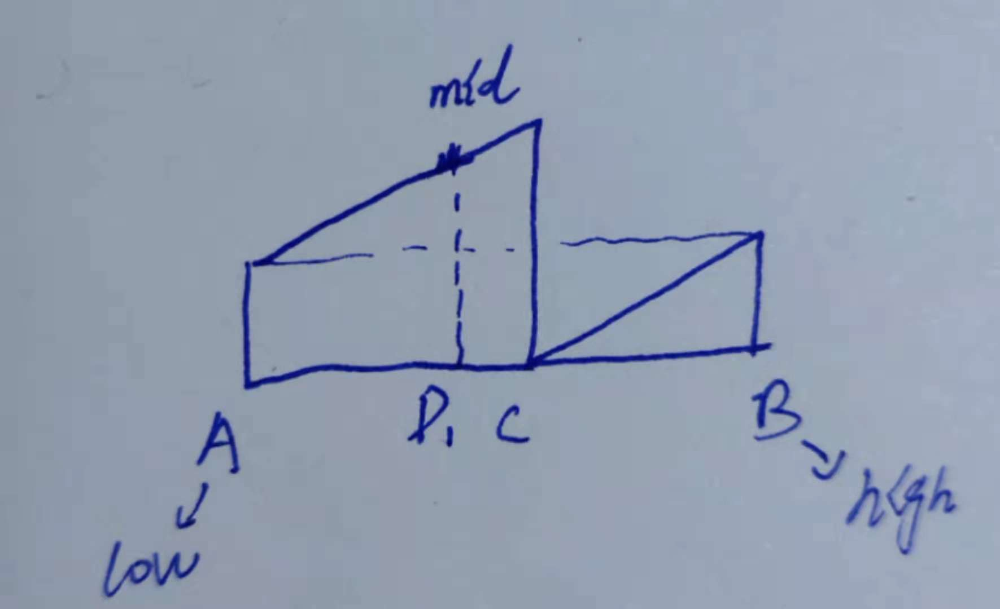
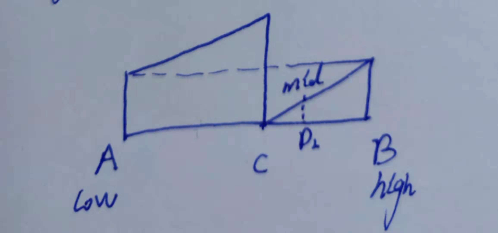

# LeetCode - 33. Search in Rotated Sorted Array

link: [https://leetcode.com/problems/search-in-rotated-sorted-array/](https://leetcode.com/problems/search-in-rotated-sorted-array/)

## 题目

Suppose an array sorted in ascending order is rotated at some pivot unknown to you beforehand.

(i.e., [0,1,2,4,5,6,7] might become [4,5,6,7,0,1,2]).

You are given a target value to search. If found in the array return its index, otherwise return -1.

You may assume no duplicate exists in the array.

Your algorithm's runtime complexity must be in the order of O(log n).

Example 1:
```
Input: nums = [4,5,6,7,0,1,2], target = 0
Output: 4
Example 2:
```

```
Input: nums = [4,5,6,7,0,1,2], target = 3
Output: -1
```
Accepted 334,119  Submissions 1,033,865


## 题目来源与背景故事

LeetCode上一道Medium题目，2018年1月面试Face++ Python后端开发时遇到过一样的题目，当时回答的不好，一直在纠结C点的位置关系；在参加2018年清华大学研究生入学考试，计算机基础知识综合912中，也遇到了类似的题目，那道题目和此题略有区别，将下图中的BC交换了，实际是一个类似y = 1 - |x|形状，即AC段单调递增，CB段单调递减，这题比较简单，所以回答的还可以


## 问题描述

给定一个有序数组，将其中前面部分，放至后面，在这样的数组中查找特定值，要求复杂度O(log N)



## 题目分析
此题目实际是是一个二分查找的应用，需要对原先二分查找的基础上修改条件判断

我们将low设置为A处，high设置在B处（右侧），mid的位置就很关键了，mid可能会落在AC之间，也可能在CB之间，接下来分情况考虑，更定输入nums，查找目标target


### 1. mid恰好就是target所在位置

这是最理想的情况，也是循环结束的条件之一


### 2. mid落在[A, C)之间



此时，mid的特点是，nums[C] < nums[B] < nums[low] <= nums[mid] <= nums[C] 

####  2.1 target位于[low, mid)之间 

此时如果target位于[low, mid)，那么target的特点是，nums[low] <= nums[target] < nums[mid]，此时target位于完全有序的[low, mid)区间，退化成了一个标准的二分查找

#### 2.2 target位于(mid, high)之间

此时如果target位于位于(mid, high)之间，此时退化成一个规模更小的旋转数组查找，此时target有两种情况

- 位于(mid, C)之间，此时target的特点是nums[mid] < target && nums[low] < target
- 位于[C, B)之间，此时target特点是nums[mid] > target && nums[low] > target 


### 3. mid落在[C, B)之间



此时，mid的特点是，nums[C]  <= nums[low] <= nums[B] < nums[mid] < nums[C] 

#### 2.1 target位于[low, mid)之间

此时如果target位于[low, mid)，那么target的特点是， nums[target] < nums[low] < nums[mid]，此时退化成一个规模更小的旋转数组查找，此时target有两种情况

- 位于[low, C)之间，此时target的特点是nums[mid] < target &&  target >= nums[low]
- 位于[C, mid)之间，此时target特点是nums[mid] > target && nums[low] > target 

#### 2.2 target位于(mid, high)之间

此时如果target位于(mid, high)，那么target的特点是，nums[mid] < nums[target] < nums[high]，此时target位于完全有序的(mid, high)区间，退化成了一个标准的二分查找


## 代码实现

```python
# -*- coding: utf-8 -*-


class Solution(object):
    def search(self, nums, target):
        """
        :type nums: List[int]
        :type target: int
        :rtype: int
        """
        low = 0
        high = len(nums)
        while low < high:
            mid = (low + high) // 2
            if target == nums[mid]:
                return mid
            if nums[mid] < nums[low]:
                if target < nums[mid] or target >= nums[low]:
                    high = mid
                else:
                    low = mid + 1
            elif nums[mid] > nums[high - 1]:
                if target > nums[mid] or target < nums[low]:
                    low = mid + 1
                else:
                    high = mid
            else:
                if target > nums[mid]:
                    low = mid + 1
                else:
                    high = mid
        return -1


if __name__ == '__main__':
    solution = Solution()
    nums = [8, 1, 2, 3, 4, 5, 6, 7]
    target = 6
    assert solution.search(nums, target) == 6

```


## 运行结果

| Time Submitted | Status                                   | Runtime | Language |
| -------------- | ---------------------------------------- | ------- | -------- |
| a day ago      | [Accepted](https://leetcode.com/submissions/detail/193848779/) | 24 ms   | python   |