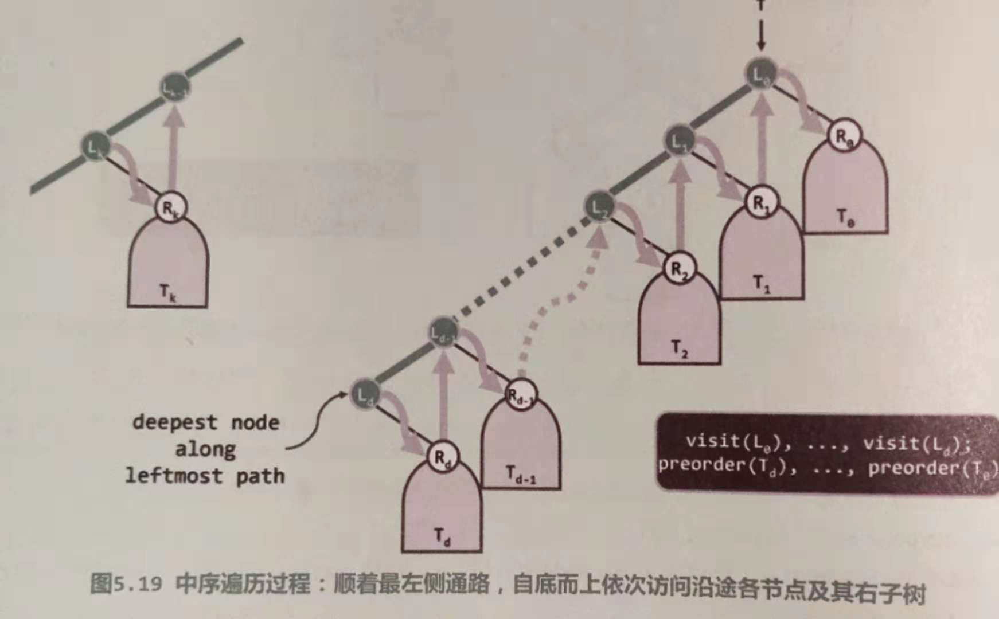

# 真二叉树重构(Proper Rebuild)

## Description
In general, given the preorder traversal sequence and postorder traversal sequence of a binary tree, we cannot determine the binary tree.


Figure 1

In Figure 1 for example, although they are two different binary tree, their preorder traversal sequence and postorder traversal sequence are both of the same.

But for one proper binary tree, in which each internal node has two sons, we can uniquely determine it through its given preorder traversal sequence and postorder traversal sequence.

Label n nodes in one binary tree using the integers in [1, n], we would like to output the inorder traversal sequence of a binary tree through its preorder and postorder traversal sequence.

## Input
The 1st line is an integer n, i.e., the number of nodes in one given binary tree,

The 2nd and 3rd lines are the given preorder and postorder traversal sequence respectively.

## Output
The inorder traversal sequence of the given binary tree in one line.

## Example
### Input
```
5
1 2 4 5 3
4 5 2 3 1
```

### Output
```
4 2 5 1 3
```

## Restrictions
For 95% of the estimation, 1 <= n <= 1,000,00

For 100% of the estimation, 1 <= n <= 4,000,000

The input sequence is a permutation of {1,2...n}, corresponding to a legal binary tree.

Time: 2 sec

Memory: 256 MB

## Hints


Figure 2

In Figure 2, observe the positions of the left and right children in preorder and postorder traversal sequence.


## 题目来源与背景

此题是【学堂在线】上2016年暑期清华大学邓俊辉老师【数据结构】MOOC课程的一道PA（现在应该还会有），之前做过一次了，但时间过去已久，对思路有所遗忘，加之最近要准备数据结构考试，这是一道很经典的二叉树构造题目，决定拿出来具体分析下


## 问题描述

给定一个二叉树的先序遍历以及后序遍历，求其中序遍历


## 题目分析

此题目需要先根据先序遍历和后序遍历的特点求出一个二叉树，然后中序遍历这个二叉树并打印每个节点的元素值

### 1. 二叉树的构造

#### 1.1 分析先序遍历和后序遍历的特点

 

- 先序遍历的第0个元素为根节点P，后序遍历的最后一个元素也是根节点P
- 先序遍历的第1个元素为其左孩子节点L
- 后序遍历中，若其右孩子R存在，则必在后序遍历的倒数第二个节点
- 后序遍历中，左孩子L左边的所有元素都是属于其左孩子所在的树
- 后序遍历中，左孩子L右边第一个元素到右孩子R都是右孩子R所在的树
- 先序遍历中，属于左（右）孩子的树的顺序必然也是其左（右）孩子所在树的先序遍历
- 后序遍历中，属于左（右）孩子的树的顺序必然也是其左（右）孩子所在树的后序遍历

#### 1.2 左右子树的分割

根据以上特点，我们可以将先序遍历和后序遍历划分出左右子树分别的元素，那么寻找左孩子L在后序遍历中的位置j（我们记i为j-1，索引均从0开始）就很重要了，找到这个位置i后，我们就可以将构造二叉树的问题分而治之为两个分别构造其左子树和右子树的问题了

- 左子树的长度为i+1，其中，其先序遍历为原先序遍历从第1个到第i个（R前一个），后序遍历为原后序遍历第0个到第i个（L）
- 右子树的长度相应为len - i - 2（去掉根节点P），其先序遍历为原先序遍历从R开始的所有，也就是从索引i+2开始，其后序遍历从原后序遍历L右侧到R，也就是从i+1开始

#### 1.3 边界情况考虑，即递归基

- 如果树的节点个数为0，其必然为空
- 如果树的节点个树为1，那么就是个没有左右子树的根节点

### 2. 中序遍历

#### 2.1 递归方法

根据中序遍历的定义，遍历一课树tree可表述为

- 中序遍历tree的左子树
- 打印tree的根节点
- 中序遍历tree的右子树

#### 2.2 迭代算法



图取自邓俊辉老师【数据结构（C++版）第3版】

中序遍历的过程就是要顺着最左侧的通路，至底而上依次访问各节点及其右子树，这满足先进后出的要求，因此可以用栈来实现

- 先沿着根节点依次访问其左子树，并将其节点依次push栈中，直至访问到最左侧的节点
- pop出栈中的元素，访问该节点，并转向右子树
- 循环过程，直至栈中再无元素


## 代码实现

```c
//
// Created by Qian Hu on 2018/12/5.
//

#include <stdio.h>
#include <stdlib.h>


typedef struct TreeNode {
    struct TreeNode* left;
    struct TreeNode* right;
    int value;
} TreeNode, *Tree;

typedef struct Stack {
    TreeNode *data;
    int top;
} Stack;


Tree buildTree(int pre[], int post[], int len) {
    Tree tree;
    if (!len) {
        return NULL;
    }
    tree = (Tree)malloc(sizeof(TreeNode));
    tree->value = pre[0];
    if (len == 1) {
        tree->left = NULL;
        tree->right = NULL;
        return tree;
    }
    int i;
    for (i = 0; i < len && post[i] != pre[1]; i++);
    tree->left = buildTree(pre + 1, post, i + 1);
    tree->right = buildTree(pre + i + 2, post + i + 1, len - i - 2);
    return tree;
}


void in_order_traverse_tree_recursion(Tree tree) {
    if (tree) {
        in_order_traverse_tree_recursion(tree->left);
        printf("%d ", tree->value);
        in_order_traverse_tree_recursion(tree->right);
    }
}


void in_order_traverse_tree_iteration(Tree tree, int num) {
    Stack *stack = (Stack *)malloc(sizeof(stack));
    stack->data = (TreeNode *)malloc(sizeof(TreeNode) * num);
    int top = 0;

    TreeNode* p = tree;
    while (1) {
        while (p) {
            stack->data[top++] = *p;
            p = p->left;
        }
        if (top == 0) {
            break;
        }
        p = &stack->data[--top];
        printf("%d ", p->value);
        p = p->right;
    }
}


int main() {
    int num;
    Tree tree;
    scanf("%d", &num);
    int *pre_order, *post_order;
    pre_order = (int*)malloc(sizeof(int) * num);
    post_order = (int*)malloc(sizeof(int) * num);
    for (int i = 0; i < num; i++) {
        scanf("%d", &pre_order[i]);
    }
    for (int i = 0; i < num; i++) {
        scanf("%d", &post_order[i]);
    }
    tree = buildTree(pre_order, post_order, num);
//    in_order_traverse_tree_recursion(tree);
    in_order_traverse_tree_iteration(tree, num);
    return 0;
}
```


## 运行结果

| Case No. | Result   | Time(ms) | Memory(KB) |
| -------- | -------- | -------- | ---------- |
| 1        | Accepted | 0        | 7296       |
| 2        | Accepted | 0        | 7296       |
| 3        | Accepted | 0        | 7296       |
| 4        | Accepted | 0        | 7296       |
| 5        | Accepted | 0        | 7296       |
| 6        | Accepted | 0        | 7296       |
| 7        | Accepted | 0        | 7296       |
| 8        | Accepted | 0        | 7296       |
| 9        | Accepted | 0        | 7296       |
| 10       | Accepted | 0        | 7296       |
| 11       | Accepted | 0        | 7296       |
| 12       | Accepted | 64       | 15572      |
| 13       | Accepted | 112      | 21352      |
| 14       | Accepted | 236      | 36364      |
| 15       | Accepted | 248      | 37932      |
| 16       | Accepted | 420      | 62752      |
| 17       | Accepted | 372      | 61780      |
| 18       | Accepted | 304      | 47800      |
| 19       | Accepted | 456      | 64404      |
| 20       | Accepted | 1416     | 207156     |