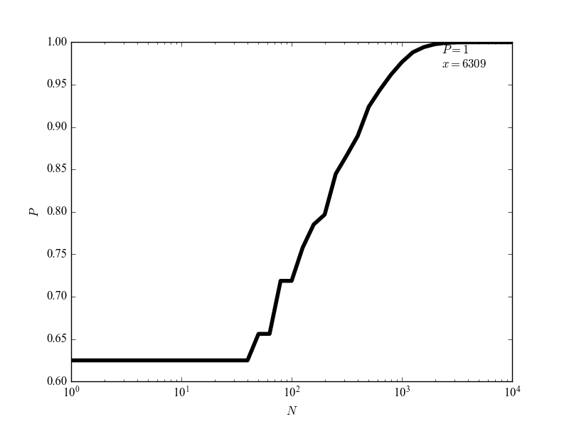

# 分汤

公粮. [题目看这里](https://leetcode-cn.com/problems/soup-servings/description/)

题目是这样的: 有 A 和 B 两种类型的汤, 初始状态下每种类型的汤有 `N` ml. 允许以下操作: 

1. 提供 100 ml 汤 A 和 0 ml 汤 B; (注: 此处**提供 100 ml 汤 A**指汤 A 减少 100 ml, 下同)
2. 提供 75 ml 汤 A 和 25 ml 汤 B; 
3. 提供 50 ml 汤 A 和 50 ml 汤 B; 
4. 提供 25 ml 汤 A 和 75 ml 汤 B. 

每回合四种操作概率相同, 问给定 `N` 求汤 A 先分配完的概率 + 汤 A 和汤 B 同时分配完的概率/2. (精确到 `1e-6` 范围内)

题目很抽象, 举个例子: 

> 输入: N = 50
>
> 输出: .625
>
> 解释: 选择前两个操作, A 直接就空了, 但 B 还没空; 第三个操作, A/B 同时空; 第四个操作, B 先空. 

看范围 `N <= 1e9` 就知道这题不可能暴力. 因此还是一个对暴力的优化问题. 这里我们选择记忆化搜索. (和 dp 相似, 但如果使用 dp 的话需要面对开很大的数组的问题... )

这里的状态肯定就是 `(Va, Vb)` 二元组对应的概率了, 没啥说的. 状态转移则是四种操作. 因此有这样的代码... 

```
const pair <int, int> OPERS[4] = { make_pair(-100, 0), make_pair(-75, -25), make_pair(-50, -50), make_pair(-25, -75) };

double helper(pair<int, int> p, map<pair<int, int>, double>& M) {
    if (p.first <= 0 && p.second <= 0) { return .5; }
    if (p.first > 0  && p.second <= 0) { return 0; }
    if (p.first <= 0 && p.second > 0)  { return 1; }
    if (!M.count(p)) {
        M[p] = 0;
        for (auto oper : OPERS) {
            M[p] += helper(make_pair(p.first+oper.first, p.second+oper.second), M);
        }
        M[p] *= .25;
    }
    return M[p];
}

double soupServings(int N) {
    map<pair<int, int>, double> M;
    auto init = make_pair(N, N);
    return helper(init, M);
}
```

很开心, 可惜还是超时了. 超时是在 `37400` 这个例子上. 可见别说是 `1e9` 了, 这方法 `1e6` 都过不去! 哪里不对呢? 

事实上, 随着 `N` 的增大, 这个概率一直是增大的. 所以, 在 `N` 足够大时, 概率就趋向于 `1` 了. 

可那要多大呢? 

我们来看看. 把程序翻译成 Python, 尝试不同的 `N` 得到的结果: 

```
import numpy as np
from matplotlib import pyplot as plt

def helper(p, M):
    if p[0] <= 0 and p[1] <= 0:
        return .5
    elif p[0] > 0 and p[1] <= 0:
        return 0
    elif p[0] <= 0 and p[1] > 0:
        return 1
    if p not in M:
        M[p] = 0
        M[p] += helper((p[0] - 100, p[1]), M)
        M[p] += helper((p[0] - 75, p[1] - 25), M)
        M[p] += helper((p[0] - 50, p[1] - 50), M)
        M[p] += helper((p[0] - 25, p[1] - 75), M)
        M[p] *= .25
    return M[p]


def soupServing(N):
    M = {}
    return helper((N, N), M)


if __name__ == '__main__':
    x = 10 ** np.arange(0, 4 + 1./10, 1./10)
    y = (np.array(map(soupServing, x)) * 1e6).astype(np.int) / 1e6
    
    plt.semilogx(x, y, 'k', linewidth=4)
    plt.xlabel('$N$')
    plt.ylabel('$P$')
    plt.xticks(fontproperties='Times New Roman')
    plt.yticks(fontproperties='Times New Roman')
    plt.annotate('$P=1$\n$x={}$'.format(int(x[-3])), xy=(x[-3], y[-3]), xytext=(x[-3] - 4000, y[-3] - .03))
    plt.show()
```

(调格式真难受啊... )

得到了这样一张图片: ([Markdown 添加图片的方法戳这里](www.jianshu.com/p/280c6a6f2594))



由此可见, 到 `N=6310` 时, 就可以直接输出 `P=1` 了. 填上这个条件, 就可以 AC 了. 

(至于那些大佬们怎么推出这个结论的, 我还真不知道~)